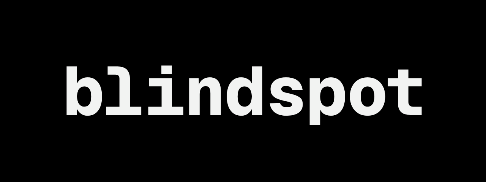

Blindspot is a simple [exiftool](https://exiftool.org/) wrapper written in Typescript, it uses the bun runtime. The idea behind this project came because I was building my website and wanted to strip the location data of the images on there (to not dox myself) but exiftool is lets just say “advanced” my smooth brain couldn’t understand their documentation.

Thats why I decided to make blindspot to easily strip metadata from images with handy presets (and a CLI argument structure you can comprehend).

---

# Installing & Requirements

You will need to have [exiftool](https://exiftool.org/) installed on your sytem (this is just a wrapper script after all)

```bash
# arch based distros
sudo pacman -S perl-image-exiftool
# debian based distros (yes ubuntu is debian based)
sudo apt install libimage-exiftool-perl
```

If your distro is not here: I am not gonna look up the package name for every distro but just install exiftool via your package manager (includes MacOS)

For windows see [install instructions](https://exiftool.org/install.html)

## Installing on Linux & MacOS

To install blindspot on these platforms its as easy as running this install command.

```bash
curl -fsSL https://raw.githubusercontent.com/kittendevv/blindspot/refs/heads/main/install.sh | bash
```

If you you want to want to install the app manually you can download the binary for your platform [here](https://github.com/kittendevv/blindspot/releases/latest/).

And if you wear a tinfoil hat in your day to day life you can also build the app yourself.

```bash
# clone repo
git clone https://github.com/kittendevv/blindspot.git
cd blindspot

# build 
bun build src/index.ts --compile --target={your-platform} --outfile dist/blindspot
```


## Installing on Windows

If your computers runs MicroSlop® Windows you can install the app by downloading the exe from [the latest release](https://github.com/kittendevv/blindspot/releases/latest/)

# Development

If you feel like questioning you sanity by looking at my spaghetti code, these are the instructions to develop this app locally.

**Requirements:** [Bun](https://bun.com/), therapist

```bash
# clone repo
git clone https://github.com/kittendevv/blindspot.git
cd blindspot
```

You can test run any command like this:

```bash
bun run src/index.ts {command here}
```
